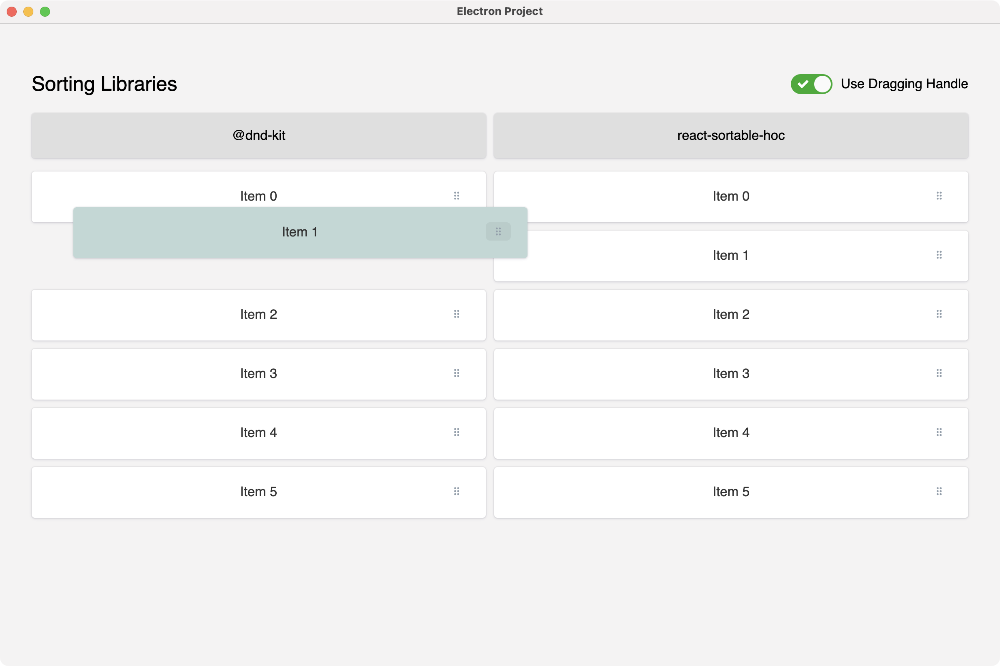

# Electron Sortable List

The example of how to use `react-sortable-hoc` and `@dnd-kit` libraries in the React application.



## Run

```bash
# Install dependencies
npm install
# Run the app
npm start
```

## Features

- Electron
- Webpack 5
- React 17
- TypeScript
- React Sortable HOC
- Dnd Kit
- Enzyme
- Jest
- Chai
